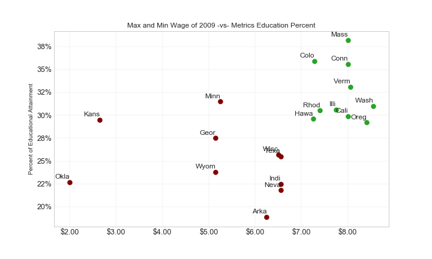
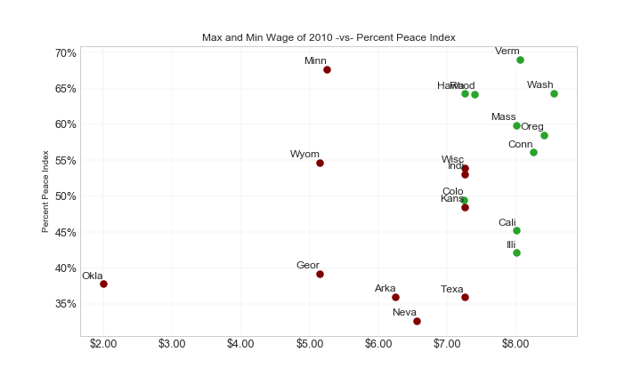

# ETL Project

## Overview:
Group Project in which the ETL process was used to analyze and compare population metrics and minimum wage data for all states during the years 2009 and 2010 using Python, Pandas, Matplolib, SQL and SQLAlchemy.

## Datasets:
## Extraction:
Our first dataset was retrieved from Kaggle.com. It displays the minimum wage "maximum and minimum" for each state in the United States during the years 1968 and 2017. We selected the minimum wage data for the years 2009 and 2010.
Our second dataset was retrieved from data.world.com. It displays 4 sociological metrics for all 50 states during different years. We selected the percetage of educational attainment, which displays the number of of individuals that have earned a bachelor's degree or higher during 2009. We also selected the percent peace index during 2010, which is measured based on homicide, violent crime, policing, incarceration and availability of small arms rates. Data was converted to percentages; the higher the % the "more peaceful" the state.

## Workflow:

A relational database called 'ETL_db’ was created in PostgresSQL pgAdmin 4 and four tables were created, and the column names and value types were specified. The ‘state’ column was set as the primary key in each table because it is present in all tables.

## Transformation:
The data was cleaned and merged in preparation to export them to the tables made in pgAdmin 4. 
Our finalized DataFrames display:
- Percentage of educational attainment.
- Minimum wage values during 2009. 
- Percent peace index in 2010.
- Minimum wage values during 2009.

## Load:
A connection called ‘engine’ was created to connect to PostgresSQL pgAdmin 4 to load our DataFrames into the SQL database.
## SQL queries:

After the DataFrames were uploaded into the pgAdmin 4 tables, joined tables were made. 

The following query joins tables ‘wage_2009’ and  ‘education’ at the primary key for each table, which is ‘state.’
All the columns for table wage_2009  are shown, as well as column ‘education_percent’ from table education.

## Observations:

Educational attainment and minimum wage were unrelated during the year 2009. The state with the highest minimum wage was Washington (8.55/hour, equivalent to 9.98/hour in 2018). However, this state was not the state with the highest % of education attainment during that same year. Moreover, the state with the lowest minimum wage value was Oklahoma (2.00/hour, equivalent to 2.33/hours in 2018). Similarly, this is not the state with the lowest % of educational attainment.

Peace percent and minimum wage were unrelated during the year 2010. The state with the highest minimum wage was Washington (8.55/hour, equivalent to 9.82/hour in 2018). However, this state was not the state with the highest peace % during that same year. Moreover, the state with the lowest minimum wage value was Oklahoma (2.00/hour, equivalent to 2.30/hours in 2018). Similarly, this is not the state with the lowest peace %

